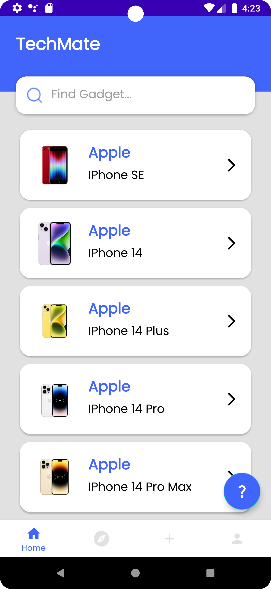
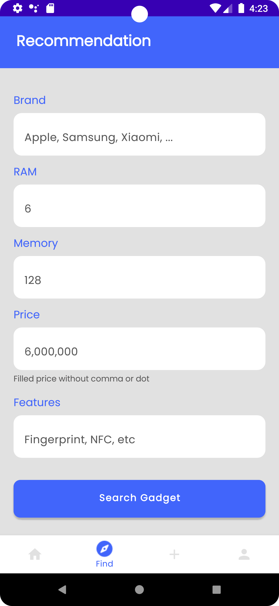

# Techmate 📱

TechMate is a gadget recommendation app that helps users find gadgets that suit their needs. This app uses technology to search for gadgets that best match the user's input based on the 3rd and 4th quarters of 2022. That way, users can choose gadgets that suit their needs and budget more effectively and efficiently.

# 🌐 Overview 

Here are some snapshots of the project:

## 📋 Requirement
- Minimum Android App SDK 24
- PC / Laptop:
  - Processor: Intel Core i3 (Recommended Intel Core i5 above).
  - RAM: 8 GB or more.
  - Screen resolution: 1280 x 800 (Full HD 1920 x 1080 recommended).

## 📚 Libraries Used
| Description | Implementation |
| --- | --- |
|[Kotlin Extensions for Android](https://developer.android.com/kotlin/ktx) | `implementation 'androidx.core:core-ktx:1.7.0'` |
|[Backwards-compatible recent features](https://developer.android.com/jetpack/androidx/releases/appcompat) | `implementation 'androidx.appcompat:appcompat:1.6.1'` |
|[Material Design Components](https://material.io/develop/android/docs/getting-started/) | `implementation 'com.google.android.material:material:1.9.0'` |
|[Constraint Layout](https://developer.android.com/training/constraint-layout) | `implementation 'androidx.constraintlayout:constraintlayout:2.1.4'` |
|[Navigation Component](https://developer.android.com/guide/navigation/navigation-getting-started) | `implementation 'androidx.navigation:navigation-fragment:2.5.3'` |
|[Circular ImageView](https://github.com/hdodenhof/CircleImageView) | `implementation 'de.hdodenhof:circleimageview:3.1.0'` |
|[Room Persistence Library](https://developer.android.com/training/data-storage/room) | `implementation "androidx.room:room-runtime:2.5.1"` |
|[Room Compiler](https://developer.android.com/jetpack/androidx/releases/room#declaring_dependencies) | `kapt "androidx.room:room-compiler:2.5.1"` |
|[Kotlin Extensions for Room](https://developer.android.com/jetpack/androidx/releases/room) | `implementation "androidx.room:room-ktx:2.5.1"` |
|[ViewModel](https://developer.android.com/topic/libraries/architecture/viewmodel) | `implementation "androidx.lifecycle:lifecycle-viewmodel-ktx:2.6.1"` |
|[LiveData](https://developer.android.com/topic/libraries/architecture/livedata) | `implementation "androidx.lifecycle:lifecycle-livedata-ktx:2.6.1"` |
|[Lifecycle components](https://developer.android.com/jetpack/androidx/releases/lifecycle) | `implementation "androidx.lifecycle:lifecycle-common-java8:2.6.1"` |
|[Glide: Image Loading and Caching library](https://github.com/bumptech/glide) | `implementation 'com.github.bumptech.glide:glide:4.14.2'` |
|[Glide compiler](https://github.com/bumptech/glide) | `kapt 'com.github.bumptech.glide:compiler:4.14.2'` |
|[Dots Indicator](https://github.com/tommybuonomo/dotsindicator) | `implementation "com.tbuonomo:dotsindicator:4.3"` |

## 📖 How to Use

1. **Install the App** 📲: Install the TechMate app from the Google Play Store on your Android device. Make sure your device supports Android SDK 24 or higher.

2. **Launch the App** 🚀: Open the TechMate app. You'll be greeted with a clean and simple user interface.

3. **Enter Your Preferences** 🕹️: In the search section, enter your preferences. You can input your preferred brand, memory, RAM, price, and any specific features you're looking for in a gadget.

4. **Get Recommendations** 📝: After entering your preferences, tap on the 'Find Recommendation' button. The app will process your input and display a list of gadgets that best match your needs.

5. **Explore Details** 🔍: You can tap on any gadget from the list to view more detailed information about it.

Remember, TechMate is designed to make the gadget selection process as easy as possible. The more precise your input, the better the recommendations!

## 💌 Feedback
We'd love to hear your thoughts on the app. If you have any suggestions or run into any issues, feel free to raise an issue in the Github repository or contact us directly.
